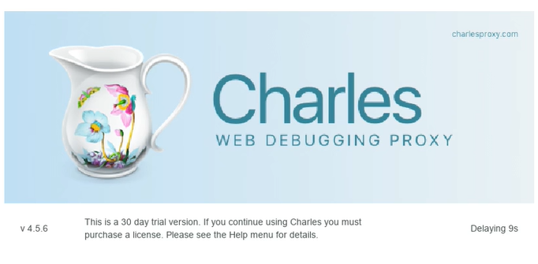
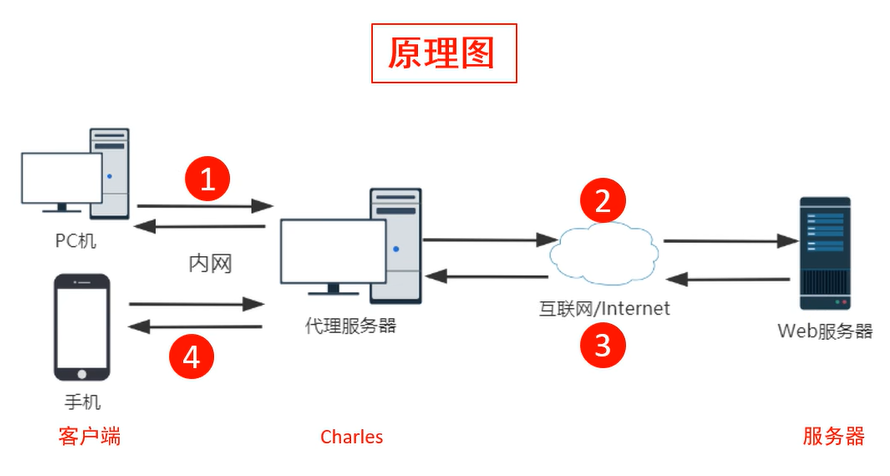
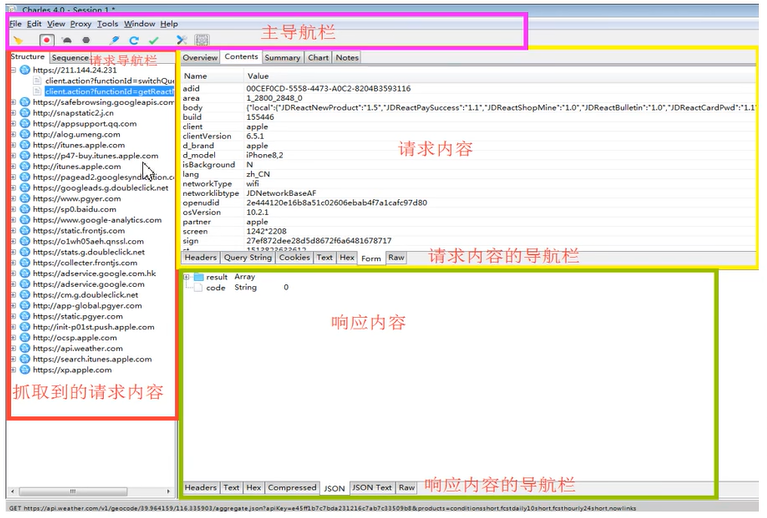
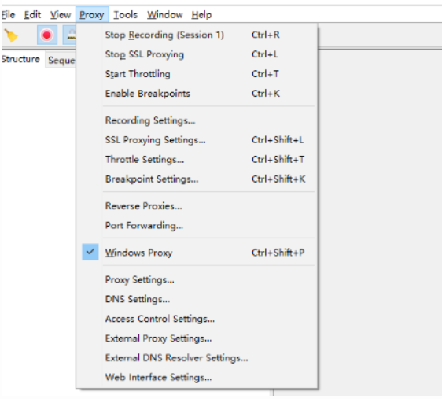
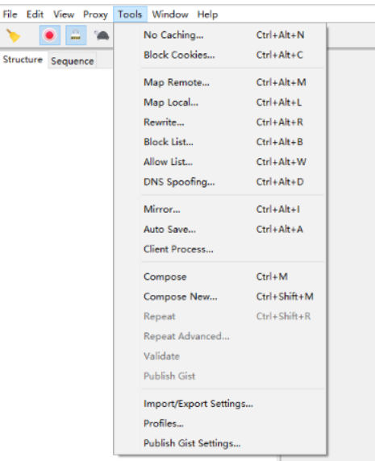
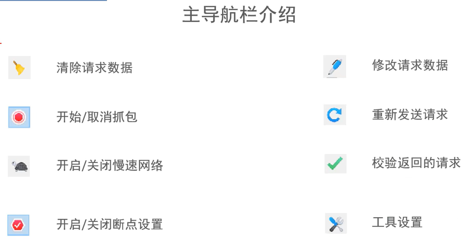
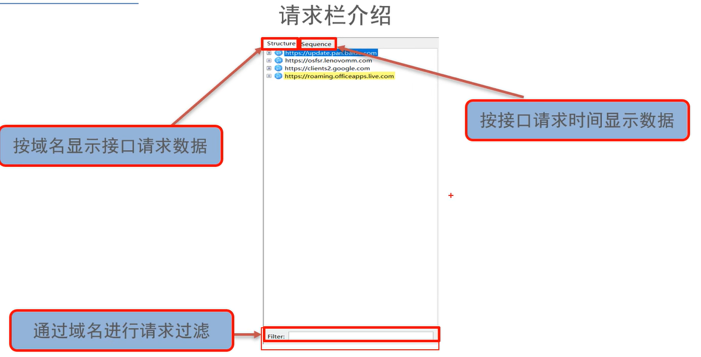
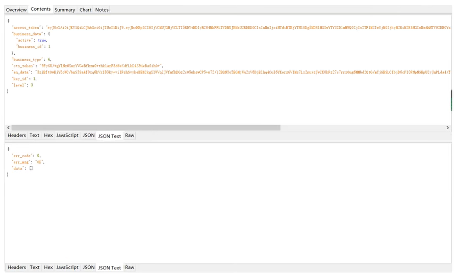
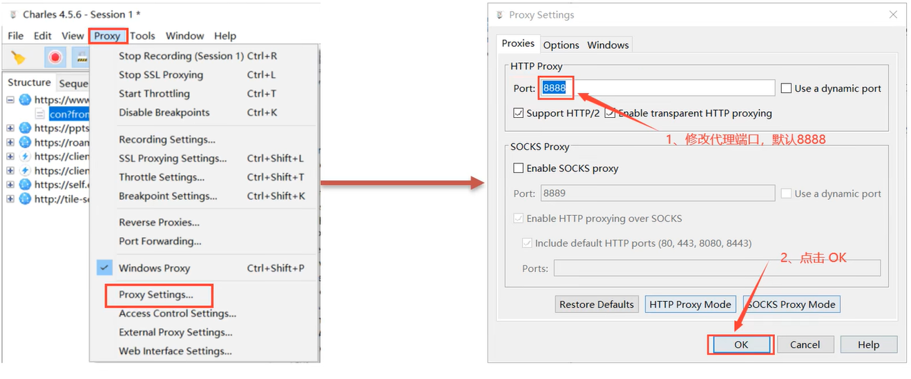
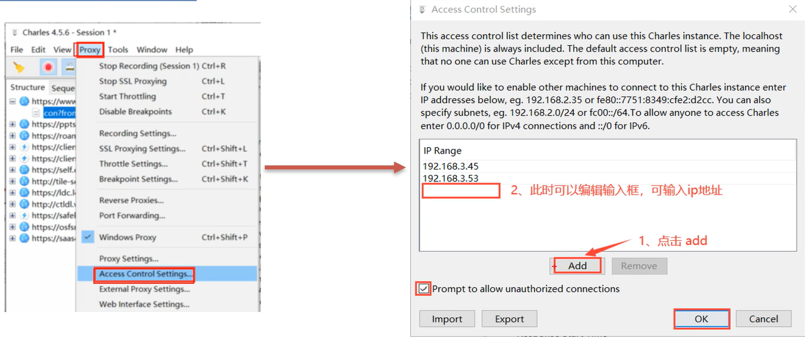

# 抓包工具Charles

**学习目标**

- 了解 Charles工作原理
- 熟练 charles的安装方式
- 掌握 charles的配置
- 掌握 安卓抓包的方法


## 一、Charles简介

### 1.Charles是什么

charles中文名叫青花瓷，它是一款基于HTTP协议的代理服务器，通过成为电脑或者浏览器的代理，然后截取请求和请求结果达到分析抓包的目的。

**特点：** 跨平台、半免费（免费版和收费版，免费版10秒打开每次使用只能30分钟）



### 2.Charles工作原理



#### 1.前置步骤

- 需要运行Charles并配置代理
- 在客户端上需要配置代理

#### 2.步骤

- 由客户端发送请求
- Charles接收再发送给服务端
- 服务端返回请求结果给Charles
- 由charles转发给客户端

#### 3.Charles主要功能

- 支持HTTP及HTTPS代理
- 支持流量控制
- 支持接口并发请求
- 支持重发网络请求
- 支持断点功能


## 二、Charles的安装与配置

### 1、Charles的安装

#### 软件安装

**官方下载**：<https://www.charlesproxy.com/latest-release/download.do>

**汉化版**：https://www.52pojie.cn/thread-1600964-1-1.html

**百度网盘：**

```text
链接：https://pan.baidu.com/s/1EpAufGI7KkDIWHCTMDdUpg 
提取码：jbjp
```

#### charles激活

试用期间每天 30分钟

```python
点击help 在点击Registered
Registered Name:		https://zhile.io
License Key: 			48891cf209c6d32bf4
```

可以使用以上方式破解


### 2、Charles组件介绍



#### 1.菜单栏

- **File 菜单包含以下功能：**

  - new session：新建会话
  - open session：打开会话
  - clear session：清除会话内容（与导航菜单中得笤帚是一样的功能）
  - close session：关闭会话
  - save session：保存会话
  - save session as：另存会话为
  - import：导入
  - export session：导出
    - quiet：关闭软件

- **Edit编辑 菜单：**

  - cut：剪切
  - copy：复制
  - paste：粘贴
  - select all：选择全部
  - find in the session：查找
  - find next：查找下一个
  - find previous：查找上一个
  - preferences：偏好设置

- **View视图 菜单**

  - 用来控制操作界面的一些图形和样式

- **Proxy 菜单包含以下功能，主要分为五大区：**

  

  - 1.常用功能开关区：
    - Start/Stop Recording：开始/停止记录会话
    - Start/Stop Proxying：开始/停止代理
    - Start/Stop Throttling ：开始/停止节流
    - Enable/Disable Breakpoints：开启/关闭断点
  - 2.常用功能设置区：
    - Recording Settings：记录会话设置
    - SSL Proxying Settings：SSL代理设置
    - Throttle Settings：节流设置
    - Breakpoint settings：断点设置
  - 3.反向代理和端口转发区域：
    - Reverse Proxies：反向代理
    - Port Forwarding：端口转发
  - 4.Charles的代理身份配置区域
    - windows proxy：Windows代理(开启整个系统通过charles作为代理)
  - 5.常用的高级设置区
    - Proxy Setting：代理设置
    - DNS Setting：DNS设置
    - Access Control Setting：访问控制设置
    - Extornal Proxy Setting：外部代理设置
    - External DNS Resolver Settings：外部DNS解析器设置。
    - Web Interface Setting：Web界面设置

- **Tools工具 菜单**

  

  - Tools 菜单包含以下功能：
    - No Caching Settings：禁用缓存设置
    - Block Cookies Settings：禁用 Cookie设置
    - Map Remote Settings：远程映射设置
    - Map Local Settings：本地映射设置
    - Rewrite Settings：重写设置
    - Black List Settings：黑名单设置
    - Allow List Settings：白名单设置
    - DNS Spoofing Settings：DNS 欺骗设置
    - Mirror Settings：镜像设置
    - Auto Save Settings：自动保存设置
    - Client Process Settings：客户端进程设置
    - Compose：编辑修改
    - Compose a new request：创建一个新请求
    - Repeat：重复发包
    - Repeat Advanced：高级重复发包
    - Validate：验证
    - Publish Gist：发布要点
    - Import/Export Settings：导入/导出设置
    - Profiles：配置文件
    - Publish Gist Settings：发布要点设置

- **Window窗口 菜单**

  - Window 菜单包含以下功能：
    - session：会话列表
    - error log：错误日志
    - active connections：正在进行访问的连接（通过这个可以查看charles是否正常运行）

- **Help帮助 菜单**

  - Help 菜单包含以下功能：
    - Registered to Registered to poppy：登录charles
    - Unregister Charles：注销charles
    - about Java：关于JAVA
    - local lP address：IP地址
    - SSL proxying：SSL代理
    - Check for Updates：检查更新
    - visit Website：访问网站
    - About Charles：关于charles


#### 2.主导航栏介绍




#### 3.请求栏介绍



- structure:按照接口域名排序
- sequence：按照接口时间显示
- filter：通过域名进行请求过滤


- 请求数据栏介绍

  

  - overview：对当前接口的概述
  - contents：请求和响应的数据信息
  - summary：一些消息概述
  - chart：图表展示的数据

### 3、Charles设置

#### 1.Charles代理设置



- 设置Charles的启动端口默认是8888，可以自行修改

#### 2.Charles访问控制

- 作用：允许哪些设备通过Charles来访问网络

  

#### 3.添加HTTPS端口监听


​	**`注：没有添加端口可能会出现乱码问题`**

## 三、PC端设置

### 1、证书

- 想要在PC上通过抓包软件，抓取网站请求相关数据包，需要导入相应的Charles证书，否则校验不通过会给出安全警告，必须安装Charles的证书后才能进行正常访问。

- 下载证书保存到浏览器跟目录

  

安装过程：点击help --》SSL proxying --》install charles root certificate --》安装证书 --》选择本地计算机 --》点下一步 --》选择将所有的证书都放入下列存储  -- 》点击浏览  -- 》选择受信任的根证书颁发机构  --》点击确定 --》点击完成


## 四、安卓抓包

作用：可以模拟真实的手机

模拟器地址：https://www.yeshen.com/

注意：首先确保自己手机的wifi和电脑在同一网络下

### 1.配置网络环境

1. 打开`cmd`输入`ipconfig`找到IPV4地址


2 . 打开模拟器设置，选择WiFi，鼠标长按不动，点击修改网络


**问题点：**

- 如果出现以下这个界面，是访问https网络没有成功签名，需要重新配置下证书。
- 如果证书配置好了，https的请求也能获取到但是还报这个错误，有可能是浏览器对证书做了限制


**小窍门：**可以先打开浏览器访问`chls.pro/ssl` 然后配置IP代理，可以解决浏览器无法输入地址问题。


### 2.配置证书

- 打开浏览器访问`chls.pro/ssl`可以直接下载证书，前提是IP代理已经成功配置
- 打开设置、安全、从sd卡安装

### 3 .成功抓包


## 五、实战案列

- 目标：采集豆果美食app上的笔记

- 项目分析：

  - 配置好抓包工具，确保能够抓到模拟器上的包
  - 触发接口api，观察接口数据
  - 构建代码发送爬虫请求


```
import json

import requests


def get_data(page):
    url = 'https://api.douguo.net/home/notes/40/20'
    headers = {
        'User-Agent':'Mozilla/5.0 (Linux; Android 7.1.2; SM-G973N Build/PPR1.190810.011; wv) AppleWebKit/537.36 (KHTML, like Gecko) Version/4.0 Chrome/92.0.4515.131 Mobile Safari/537.36'
    }
    data = {
        "client": "4",
        "_session": "1670347900014351564608872123",
        "direction": "2",
        "btmid": "{}",
        "is_new_user": "0",
        "request_count": str(page),
        "sign_ran": "8b3bbbd68fead8c06020f4fc3f266e3f",
        "code": "54adff5470d6b097"
    }
    response = requests.post(url, headers=headers, data=data)
    return response.json()


def parase_data(data):
    for i in data['result']['list']:
        print(i)
        item = {}
        item['title'] = i['note']['title']
        item['name'] = i['note']['author']['n']
        item['action_url'] = i['note']['action_url']
        save_data(item)

def save_data(item):
    with open('douguo.json', 'a+', encoding='utf-8')as f:
        f.write(json.dumps(item, indent=2, ensure_ascii=False))
        f.write(',\n')


def main():
    for i in range(1, 5):
        json_data = get_data(i)
        parase_data(json_data)

if __name__ == '__main__':
    main()
```

