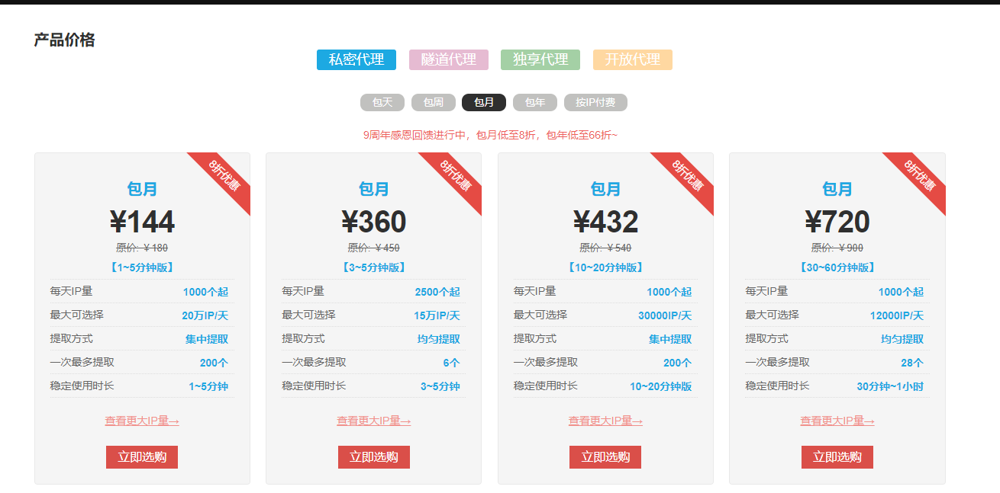
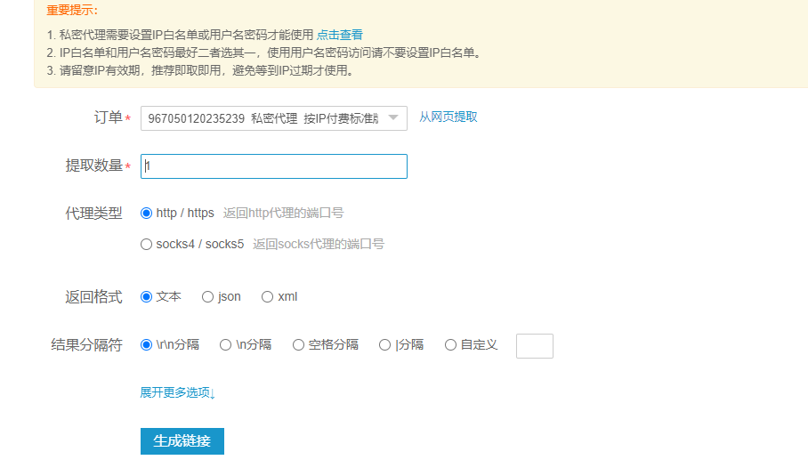
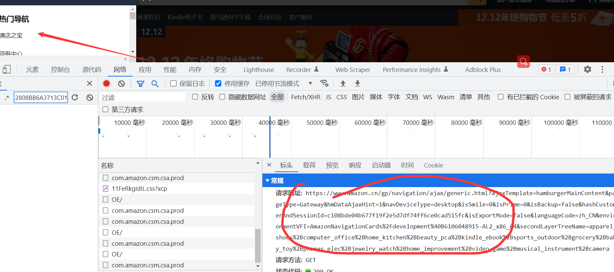

# IP代理池的搭建方法

**学习目标：**

- 了解 使用代理的原因
- 掌握 免费代码的采集和测试
- 熟悉 付费代理的获取流程


## 一、免费ip的采集和使用

### 1、使用ip的作用和原因

- 首先代理ip可以保护用户信息的安全。在如今的大数据互联网时代，每个人上网总会留下一点信息，很有可能被别人利用，而使用代理ip可以完美解决这个问题。高匿名代理ip可以隐藏用户的真实ip地址，保护用户的个人数据和信息安全，提高用户上网的安全性。
- 其次可以提高访问速度，有时出现过访问网页时出现卡顿的问题，通过代理ip一定程度上可以解决这个问题。通过代理IP访问的一些网站等信息会存留在代理服务器的缓冲区内，假如别人访问过的信息你再访问，则会直接在缓冲区内拉取数据，进一步提高访问速度。遇到对ip检测比较严格的网址也需要进行替换。
- 代理区分：https://www.zhihu.com/question/442503446/answer/2516935440

### 2、免费ip网址

- 可以从以下网址中采集到批量的ip地址

  ```
  西刺代理:http://www.xicidaili.com

  快代理:https://www.kuaidaili.com

  云代理:http://www.ip3366.net

  无忧代理:http://www.data5u.com/

  360 代理:http://www.swei360.com

  66ip 代理:http://www.66ip.cn

  ip 海代理:http://www.iphai.com

  大象代理:http://www.daxiangdaili.com/

  米扑代理:https://proxy.mimvp.com/freesecret.php

  站大爷:http://ip.zdaye.com/

  讯代理:http://www.xdaili.cn/

  蚂蚁代理:http://www.mayidaili.com/free

  89免费代理:http://www.89ip.cn/

  全网代理:http://www.goubanjia.com/buy/high.html

  开心代理:http://www.kxdaili.com/dailiip.html

  猿人云:https://www.apeyun.com/
  ```

### 3、采集ip数据和测试

- 我们在网站上采集的免费ip能使用率不足20%，所以我们采集的ip需要先进行测试，测试完之后存放到文本，或者数据库

```python
import time
import requests
from lxml import etree


class DaiLi(object):
    def __init__(self):
        self.base_URL = 'https://www.kuaidaili.com/free/inha/{}/'
        self.test_URL = 'http://httpbin.org/ip'
        self.headers = {
            'User-Agent': 'Mozilla/5.0 (Windows NT 10.0; Win64; x64) AppleWebKit/537.36 (KHTML, like Gecko) '
                          'Chrome/107.0.0.0 Safari/537.36 Edg/107.0.1418.35'}
        self.base_xpath = '//div/div/table[@class="table table-bordered table-striped"]/tbody/tr'

    def get_response(self, url, proxies=None):
        try:
            response = requests.get(url=url, headers=self.headers, proxies=proxies)
            # time.sleep(0.5)
            return response.text
        except Exception as f:
            print('请求有误,错误为：%s' % f)

    def get_url(self, page):
        url = self.base_URL.format(page)
        return url

    def xpath_html(self, html):
        html1 = etree.HTML(html)
        datas = html1.xpath(self.base_xpath)
        DiZhi = []
        for i in datas:
            dizhi = {'IP': i.xpath('./td/text()')[0], 'DuanKou': i.xpath('./td/text()')[1]}
            DiZhi.append(dizhi)
        return DiZhi

    def save_data(self, data):
        IPS = []
        for i in data:
            proxies = {'http': 'http://' + i['IP'] + ':' + i['DuanKou']}
            try:
                print(proxies)
                response = requests.get(url=self.test_URL, headers=self.headers, proxies=proxies, timeout=2)

                if response.status_code == 200:
                    print(response.status_code)
                    print(response.text)
                    IPS.append(proxies)

            except Exception:
                print('超时链接')
        print(IPS)

    def run(self):
        for i in range(1, int(input('输入爬取页码')) + 1):
            url = self.get_url(i)
            html = self.get_response(url)
            data = self.xpath_html(html)
            self.save_data(data)


if __name__ == '__main__':
    dl = DaiLi()
    dl.run()
```

**注意：** 免费ip采集存放到ip池之后，每次使用的时候也需要测试也会有过期的情况


## 二、付费ip的使用

- 两着的优缺点：
  - 免费：除了免费，没有优点
  - 付费：除了付费，没有缺点

### 1、使用方法

- 快代理：https://www.kuaidaili.com/


- 找到自己喜欢的付费ip代理平台（案列：快代理，不同的代理平台都有对应文档和客服）
  - 在平台注册一个账户

  - 根据自己的项目选择购买的套餐

    

  - 购买之后点击账户管理 -- 》我的订单 --》点击更多 -- 》点击提取ip --》点击生成api链接

  - 根据项目需求修改你需要的提取数量，返回的格式和分割符

  

  - 请求生成的接口就能获取到对应的ip数据


## 三、实战案列

- 采集目标：亚马逊

- 采集网址：https://www.amazon.cn/

- 项目思路分析：

  - 首先在页面找到所有的物品分类接口

    

  - 在提取的页面里会包含广告请求，需要剔除掉

  - 在获取到每个分类所对应的页数，获取到所有页数对应的网址

  - 对页数发送请求，在提取出每个商品的详情页面地址

  - 在页面里在提取出商品数据进行保存


```python
#!/usr/bin/env python
# -*- encoding: utf-8 -*-
# @File  :   ymx_spider.py    
# Author :   柏汌
import random
import time
from loguru import logger
import requests
from lxml import etree
from queue import Queue
import threading
from retrying import retry
from feapder.network.user_agent import get
import pymysql


class Yamaxun():
    def __init__(self):
        self.db = pymysql.connect(host="localhost", user="root", password="root", db="spiders")
        self.cursor = self.db.cursor()
        self.index_url = 'https://www.amazon.cn/gp/navigation/ajax/generic.html?ajaxTemplate=hamburgerMainContent&pageType=Gateway&hmDataAjaxHint=1&navDeviceType=desktop&isSmile=0&isPrime=0&isBackup=false&hashCustomerAndSessionId=c108bde04b677f19f2e5d7df74ff6ce0cad515fc&isExportMode=false&languageCode=zh_CN&environmentVFI=AmazonNavigationCards%2Fdevelopment%40B6099827072-AL2_x86_64&secondLayerTreeName=apparel_shoes%2Bcomputer_office%2Bhome_kitchen%2Bbeauty_pca%2Bkindle_ebook%2Bsports_outdoor%2Bgrocery%2Bbaby_toy%2Bphones_elec%2Bjewelry_watch%2Bhome_improvement%2Bvideo_game%2Bmusical_instrument%2Bcamera'
        self.headers = {
            "Referer": "https://www.amazon.cn/ref=nav_logo",
            "User-Agent": "Mozilla/5.0 (Windows NT 10.0; Win64; x64) AppleWebKit/537.36 (KHTML, like Gecko) Chrome/107.0.0.0 Safari/537.36",
            "X-Requested-With": "XMLHttpRequest",
            "downlink": "10",
            "ect": "4g",
            "rtt": "200",
        }
        self.ip_url = 'https://dps.kdlapi.com/api/getdps/?secret_id=oehuhmiu2sa06xeyaq4g&num=1&signature=ozbo6ljjchgyl1g39wds702683&pt=1&sep=1'
        self.ip_queue = Queue()
        self.classify_url_queue = Queue()
        self.detail_url_queue = Queue()
        self.data_queue = Queue()

    def create_table(self):
        # 使用预处理语句创建表
        sql = '''
                    CREATE TABLE IF NOT EXISTS yamaxun(
                        id int primary key auto_increment not null,
                        price VARCHAR(255) NOT NULL, 
                        title VARCHAR(255) NOT NULL,
                        goods_url VARCHAR(255) NOT NULL,
                        classify VARCHAR(255) NOT NULL)
                    '''
        try:
            self.cursor.execute(sql)
            print("CREATE TABLE SUCCESS.")
        except Exception as ex:
            print(f"CREATE TABLE FAILED,CASE:{ex}")

    def get_ip(self):
        """
        获取ip数据，将ip数据放进队列
        :return: ip地址
        """
        while True:

            if self.ip_queue.empty():

                response = requests.get(self.ip_url)
                print(response.text)
                self.ip_queue.put(response.text)
            else:

                continue

    # 最大重试3次，3次全部报错，才会报错
    @retry(stop_max_attempt_number=3)
    def get_data(self, url):
        ip = self.ip_queue.get()
        proxies = {
            'http': 'http://' + ip,

        }
        # print(proxies)
        self.headers['User-Agent'] = get()
        response = requests.get(url=url, headers=self.headers, timeout=5, proxies=proxies)
        if response.status_code == 200:
            self.ip_queue.put(ip)
        else:
            assert '状态码错误'
        return response

    def get_info_url(self):
        response = self.get_data(self.index_url)
        html_object = etree.HTML(response.text)
        # 前两个没有请求地址
        li_list = html_object.xpath('//ul/li[position() > 2]')
        for li in li_list:
            item = {}
            if li.xpath('./a/text()'):
                # 全部分类的数据是分类页面
                if '全部' in li.xpath('./a/text()')[0]:
                    continue
                # 带有https的为广告页面
                if 'http' in li.xpath('./a/@href')[0]:
                    continue

                item['title'] = li.xpath('./a/text()')[0]
                # item['href'] = li.xpath('./a/@href')[0]


                # print(li.xpath('./a/@href')[0])
                item['href'] = li.xpath('./a/@href')[0].split('=')[1].split('&')[0]

                self.classify_url_queue.put(item)

    def detail_url_get(self):
        while True:
            info_url = self.classify_url_queue.get()
            time.sleep(random.randint(500, 800)/1000)
            try:
                # 请求分类查看所有商品页面
                response = self.get_data("https://www.amazon.cn/s?rh=n%3A" + info_url['href'] + "&fs=true")
            except Exception as e:
                logger.error("https://www.amazon.cn/s?rh=n%3A" + info_url['href'] + "&fs=true")
                continue
            html_data = etree.HTML(response.text)
            if html_data.xpath('//span[@class="s-pagination-strip"]/span[last()]/text()'):
                # 获取到分类的总共页数
                max_page = html_data.xpath('//span[@class="s-pagination-strip"]/span[last()]/text()')[0]
                for page in range(1, int(max_page) + 1):
                    # 每个分类单独页面拼接
                    new_url = 'https://www.amazon.cn/s?rh=n%3A' + info_url['href'] + '&fs=true&page=' + str(page)
                    # 请求每个分类的单独页面
                    try:
                        res = self.get_data(new_url)
                    except Exception as e:
                        logger.error(new_url)
                        continue

                    html = etree.HTML(res.text)
                    detail_href_list = html.xpath('//div[@class="sg-col-inner"]/span/div[1]/div/div/div//h2/a/@href')
                    # time.sleep(random.randint(200, 500) / 1000)
                    # 获取到详情商品的详情地址和分类
                    for detail_href in detail_href_list:
                        item = {}
                        item['detail_href'] = detail_href
                        item['classify_data'] = info_url['title']

                        self.detail_url_queue.put(item)
            self.classify_url_queue.task_done()

    def paras_data(self):
        while True:
            goods_data = self.detail_url_queue.get()
            # 拼接详情页面
            goods_url = 'https://www.amazon.cn' + goods_data['detail_href']
            try:
                response = self.get_data(goods_url)
            except Exception as e:
                logger.error(goods_url)
                continue
            html_data = etree.HTML(response.text)
            # 获取商品标题
            title = html_data.xpath('//div[@id="centerCol"]//h1/span/text()')[0] if html_data.xpath(
                '//div[@id="centerCol"]//h1/span/text()') else '空'
            # 获取商品价格
            if html_data.xpath('//div[@id="centerCol"]//div[@id="apex_desktop"]//span[@class="a-price-whole"]/text()'):
                price = "￥" + html_data.xpath(
                    '//div[@id="centerCol"]//div[@id="apex_desktop"]//span[@class="a-price-whole"]/text()')[0]
            else:
                price = '-'.join(html_data.xpath(
                    '//td[@class="a-span12"]//span[@class="a-offscreen"]/text()'))
            print([goods_data['classify_data'], title.strip(), price, goods_url])
            self.data_queue.put((goods_data['classify_data'], title.strip(), price, goods_url))
            self.detail_url_queue.task_done()

    def save_data(self):
        while True:
            data_list = []
            for i in range(30):
                data = self.data_queue.get()
                data_list.append((0,) + data)
                self.data_queue.task_done()

            # SQL 插入语句
            sql = 'INSERT INTO yamaxun(id, price, title, classify, goods_url) values(%s, %s, %s, %s, %s)'
            # 执行 SQL 语句
            try:
                # print(sql, (0, data[0], data[1], data[2], data[3]))
                self.cursor.executemany(sql, data_list)
                # 提交到数据库执行
                self.db.commit()
                print('数据插入成功...')
            except Exception as e:
                print(f'数据插入失败: {e}')
                # 如果发生错误就回滚
                self.db.rollback()


    def main(self):
        self.create_table()
        t_list = []
        # 获取ip线程
        t_ip = threading.Thread(target=self.get_ip)
        t_list.append(t_ip)
        # 获取分类线程
        t_info = threading.Thread(target=self.get_info_url)
        t_list.append(t_info)
        # 获取详细商品线程
        for i in range(2):
            t_detail_url = threading.Thread(target=self.detail_url_get)
            t_list.append(t_detail_url)
        # 解析数据线程
        for i in range(3):
            t_paras = threading.Thread(target=self.paras_data)
            t_list.append(t_paras)
        # 保存数据线程
        t_save = threading.Thread(target=self.save_data)
        t_list.append(t_save)

        for t in t_list:
            t.setDaemon(True)
            t.start()

        time.sleep(3)
        for q in [self.classify_url_queue, self.detail_url_queue, self.detail_url_queue]:
            q.join()


if __name__ == '__main__':
    # 文件过大于500M就会重新生成一个文件
    logger.add("runtime_{time}.log", rotation="500 MB")
    ymx = Yamaxun()
    ymx.main()
```

- logger模块使用方法：https://blog.csdn.net/Vertira/article/details/127430742